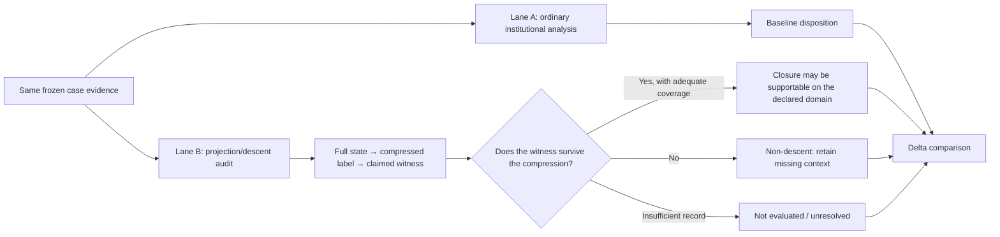

# Institutional Projection/Descent Comparative Run v0.1

## A paired baseline-versus-geometry pilot for human institutional research

**Assessment date:** 3 September 2026  
**Evidence cutoff:** inherited from the controlling case artifacts; no external-world factual update was performed for this pilot  
**Method status:** exploratory comparative instrument run  
**Geometry status:** diagnostic overlay only; no claim that human institutions are physical tori  
**Authority rule:** the ordinary evidence-based lane controls every factual and causal disposition

## Result

The geometry-informed lane changed **zero of five** controlling case verdicts. That is a useful result, not a failure.

It added meaningful research discipline in four cases:

1. It exposed the legal title “executive order/proclamation” as a lossy projection that cannot determine operative authority without the underlying constitutional or statutory source.
2. It converted the Medicaid custody-versus-use distinction into an explicit missing-state and missing-transition record.
3. It forced the Iran–fuel–Spirit analysis to retain Spirit's prior insolvency, liquidity, financing, and decision state rather than treating the price shock as a sufficient cause.
4. It separated literary Revelation comparison from any predictive or identity-bearing use of a character label.

It added little to the Marble-confirmation chronology because ordinary date ordering already defeats the specific 2021-sale-proceeds claim. That negative-control result is important: the geometry should not be used where a simpler test already decides the question.

The correct integration decision is therefore:

> **Keep projection/descent as an optional adversarial audit layer. Do not insert toroidal physics into the human-systems ontology, do not let the geometry upgrade evidence, and do not require it when ordinary chronology or source analysis already resolves the claim.**

## Inputs and authority

| Input | Role in this run | Authority limit |
|---|---|---|
| [`TOROIDAL_GEOMETRY_OMNIBUS_v1.1.md`](<C:\Users\drewd\OneDrive\Desktop\Toroidal_scrotal_posturing-main\TOROIDAL_GEOMETRY_OMNIBUS_v1.1.md>) | Supplies full-state, projection, witness, descent, clock-separation, and status vocabulary | Internal mathematical synthesis; execution is blocked, Q2 is closed, and platform instantiation is not established |
| [`ARCHITECTURE_OF_CAPTURE_COMPANION_v1.md`](./ARCHITECTURE_OF_CAPTURE_COMPANION_v1.md) | Supplies the baseline lane structure, function-before-occupant rule, null model, contamination gate, and no-composite-score rule | Conceptual instrument; not independently validated |
| [`EVENT_CLUSTER_2025_2026_EVIDENCE_AUDIT_v1.md`](./EVENT_CLUSTER_2025_2026_EVIDENCE_AUDIT_v1.md) | Supplies the Iran–Hormuz–jet-fuel–Spirit causal record and its counterevidence | Controls the event-chain disposition used here; not re-researched in this run |
| [`CONGRESS_SHUTDOWNS_EXECUTIVE_ORDERS_INSTRUMENT_RUN_v1.md`](./CONGRESS_SHUTDOWNS_EXECUTIVE_ORDERS_INSTRUMENT_RUN_v1.md) | Supplies the law/directive/shutdown distinctions and matched legal cases | Controls the institutional-law disposition used here; no legal update in this run |
| [`REVELATION_FUNCTIONAL_CAST_MAP.md`](./REVELATION_FUNCTIONAL_CAST_MAP.md) | Supplies the current Medicaid, Marble, named-person, and Revelation-function dispositions | Derivative integrated audit; its inherited source conclusions are not upgraded here |

The unavailable underlying source register and Routes draft were not silently reconstructed. Where the Revelation map carries an inherited Routes disposition, this run tests the **methodological form of that disposition**, not the underlying sources anew.

## What was translated—and what was not

### Admitted method components

| Geometry term | Human-systems translation |
|---|---|
| Full state `X` | Dated actors, offices, legal authorities, instruments, resources, prior conditions, decisions, and outcomes needed by the claim |
| Projection `π(X)` | A compressed label such as “executive order,” “data custody,” “Beast-function,” “fuel shock,” or “donor network” |
| Retained context `C` | The variables that must accompany the label: statutory source, chronology, institutional role, prior condition, access, review, or operational record |
| Operator or transition `Ψ/P` | The documented act that can change institutional state: enactment, presidential finding, transfer, contract action, price shock, financing refusal, agency use, or appointment |
| Witness `W` | The outcome the claim says should be preserved or predicted: lawful authority, platform use, enforcement consequence, shutdown, campaign spending, or role completion |
| Descent test | Whether the same compressed label carries the same relevant witness across materially different full states |
| Non-descent | At least one same-label comparison produces a different relevant witness, showing that the label omitted necessary context |
| Clock tuple | Separate event order, physical time, statutory deadlines, reset points, and eligibility conditions |

### Excluded ontology

The following are **not** imported into the human research model:

- literal toroidal space;
- gauge fields or physical gauge equivalence;
- winding number, parity sector, `q`, cocycle, or holonomy as social facts;
- partition functions, confinement, or phase-transition claims;
- an assertion that human institutions obey the TOROIDAL simulation kernel;
- any platform-instantiation claim;
- any evidentiary weight from mathematical elegance.

These terms may remain in the source mathematics. The comparative instrument uses only their general information-loss and state-retention logic.

## Paired design



### Predeclared comparison questions

For each case:

1. What is the narrow baseline claim?
2. What full state would be required to evaluate it?
3. What information does the proposed label discard?
4. What witness or outcome is being claimed?
5. Is there a genuine same-label comparison, a chronological impossibility, or only missing coverage?
6. Does the geometry change the disposition, add a discriminating test, merely restate the baseline, or introduce metaphor leakage?

### Status vocabulary

| Status | Meaning in this pilot |
|---|---|
| `NOT_CLAIMED` | The label is descriptive; no autonomous or predictive law is asserted |
| `NOT_EVALUATED` | The necessary matched states or transition records are absent |
| `UNRESOLVED_INSUFFICIENT_COVERAGE` | Some relevant records exist, but they cannot test the proposed witness across the required state space |
| `SAMPLE_CONSISTENT` | Covered examples agree, without establishing a universal rule |
| `CLOSED_ON_DECLARED_DOMAIN` | A proof or exhaustive bounded comparison supports the projection for the named witness and domain |
| `FAILED / NON_DESCENT` | A same-projection comparison has a different witness, so the projection is insufficient |
| `REJECTED_AS_FRAMED` | Chronology, domain, or source structure defeats the proposed arrow before a descent test is needed |

No `CLOSED_ON_DECLARED_DOMAIN` result was earned in this pilot.

## Comparative matrix

| Case | Lane A baseline disposition | Geometry-lane result | Verdict changed? | Added research value |
|---|---|---|---:|---|
| `PD-01` Iran → Hormuz → jet fuel → Spirit | Supported as a material precipitating chain; fuel was not the sole cause | Monocausal price-shock projection is insufficient unless prior firm state is retained; formal descent not evaluated across carriers | No | Clarifies necessary state and counterfactual |
| `PD-02` Medicaid custody → ELITE ingestion/use → person-level enforcement | Custody route supported; ingestion and person-level use not established | Custody is a valid observation but does not descend to operational-use or enforcement witnesses on the available record | No | Converts the hold into a precise missing-transition schema |
| `PD-03` Marble 2021 sale proceeds → Gorsuch/Kavanaugh/Barrett confirmations | Specific arrow retired on chronology | `REJECTED_AS_FRAMED`; later operator cannot cause already completed outcomes | No | Little beyond chronology; negative control for method overuse |
| `PD-04` “Executive order” label → operative executive authority | Directive force depends on Article II or statute; matched cases produce different outcomes | Explicit `FAILED / NON_DESCENT` for directive-title-only projection | No | Strongest gain: identifies authority source as indispensable retained context |
| `PD-05` Named modern person → Revelation character | Functional comparison permitted; literal identity/prediction not established | `NOT_CLAIMED` for literary comparison; current identity claims are `REJECTED_AS_FRAMED`, while a universal descent law is not evaluated | No | Sharpens the boundary between grammar and screenplay |

## Case `PD-01` — Iran, Hormuz, jet fuel, and Spirit

### Lane A: ordinary institutional/causal analysis

The event audit supports this bounded chain:

> U.S.–Iran conflict → maritime danger and severe Hormuz throughput loss → oil and jet-fuel price shock → increased Spirit cash burn and financing need → Spirit flight shutdown.

The same audit retains Spirit's pre-existing bankruptcy, weak liquidity, failed financing, and other pressures. Fuel was a material precipitant, not a sufficient or sole cause.

### Lane B: projection/descent audit

- **Full state:** conflict and attack state; throughput; fuel-price path; Spirit hedge position; prior bankruptcies; liquidity; debt; fleet and labor obligations; available financing; creditor decisions; board/management decision.
- **Proposed projection:** `π(X) = severe jet-fuel shock`.
- **Claimed witness:** `W(X) = airline flight shutdown`.
- **Discarded context:** firm solvency, hedging, liquidity, financing access, and decision authority.
- **Same-label comparison required:** carriers exposed to a similar fuel shock but entering it with different financial states.
- **Available coverage:** the controlling audit does not supply a matched carrier panel or exhaustive counterfactual.
- **Descent result:** `NOT_EVALUATED` as a formal cross-firm descent claim. The deterministic statement “fuel shock implies shutdown” remains rejected by the baseline record.

### Delta

The geometry does not strengthen causal confidence. It explains why the existing qualification is structurally necessary: the projected price shock discards the financial variables that mediate shutdown. Its useful output is a future comparison design—matched carriers, hedge books, liquidity, rescue terms, and shutdown timing—not a new finding.

## Case `PD-02` — Medicaid-data custody versus operational use

### Lane A: ordinary institutional/causal analysis

The controlling integrated map preserves a narrow custody route while holding the stronger arrow:

> CMS/HHS data reached ICE and was shared with Palantir personnel; ELITE ingestion, queries, targeting, arrest, detention, removal, and person-level consequence were not established.

### Lane B: projection/descent audit

- **Full state:** legal/data-sharing authority; dataset identity and fields; sender and recipient; transfer channel; custody and deletion state; platform ingestion status; index/build state; queries; outputs; analyst actions; target records; enforcement decisions; person-level outcomes; timestamps and audit logs.
- **Proposed projection:** `π(X) = vendor received or possessed dataset`.
- **Claimed witness:** `W(X) = dataset entered ELITE or caused enforcement action`.
- **Discarded context:** ingestion, availability to operational users, query execution, output generation, decision reliance, and causal linkage to a person.
- **Available coverage:** custody evidence and party representations exist; system and person-level transitions do not.
- **Descent result:** custody as an observable is `NOT_CLAIMED` to be an autonomous law. The custody-to-use projection is `UNRESOLVED_INSUFFICIENT_COVERAGE`, not a zero, pass, or failure.

### Delta

The geometry adds a precise acquisition schema:

```text
transfer receipt
→ custody inventory
→ ingestion/build log
→ query record
→ output/target record
→ decision-use record
→ person-level consequence
```

Each arrow needs its own operator receipt and timestamp. Evidence at an earlier node cannot be transported to a later witness. This formalizes—without changing—the existing custody/use firewall.

## Case `PD-03` — Marble sale proceeds and Supreme Court confirmations

### Lane A: ordinary chronology

The integrated map retires the claim that Marble's approximately $1.6 billion in 2021 sale proceeds funded the already completed Gorsuch, Kavanaugh, and Barrett confirmation campaigns. Any different pre-confirmation Marble → Barrett route requires its own dated transfer and expenditure evidence.

### Lane B: projection/descent audit

- **Full state:** entity formation; asset-transfer date; sale date; receipt date; campaign dates; expenditure dates; payor; recipient; invoices and ad buys.
- **Proposed projection:** `π(X) = later large-scale Leo-associated funding architecture`.
- **Claimed witness:** `W(X) = funding of earlier named confirmation campaigns`.
- **Clock rule:** a causal funding operator must precede the claimed expenditure and outcome.
- **Result:** `REJECTED_AS_FRAMED` before descent analysis. The named 2021 proceeds are outside the causal time domain of the completed confirmations.

### Delta

No material gain. A date table already performs the decisive work more simply and transparently. This case is the pilot's anti-bloat control: adding geometric vocabulary would reduce clarity unless restricted to the one-line rule that an operator cannot act backward through the event clock.

## Case `PD-04` — Directive title versus operative authority

### Lane A: ordinary legal analysis

The Congress/Executive instrument establishes that an executive order, proclamation, or memorandum receives force from Article II or statutory delegation, not from its title. Within Congress's constitutional domain, an inconsistent statute controls, subject to narrow exclusive Article II exceptions.

The matched cases include:

- *Youngstown*: a presidential seizure order lacked statutory support and conflicted with congressional design; it was invalid.
- *Trump v. Hawaii*: a proclamation operated under broad authority supplied by INA §212(f); it was upheld within that delegated domain.

### Lane B: projection/descent audit

Let the compressed label be

```text
π(X) = presidential directive
```

and the witness be

```text
W(X) = legally operative authority for the challenged action.
```

Two full states share the projection but have different witnesses:

| Full state | Compressed label | Retained authority context | Witness |
|---|---|---|---|
| *Youngstown* seizure order | Presidential directive | No seizure delegation; contrary congressional design | Challenged seizure authority invalid |
| *Trump v. Hawaii* proclamation | Presidential directive | Broad INA §212(f) delegation and required presidential finding | Challenged entry restriction upheld |

This is an explicit same-projection, different-witness pair.

- **Descent result:** `FAILED / NON_DESCENT` for directive-title-only authority.
- **Missing state that repairs the projection:** direct Article II domain; statutory provision; delegation breadth; required finding; contradiction with enacted law; appropriation; implementation act; review channel; procedural posture.

### Delta

This is the strongest result of the pilot. The geometry supplies a compact proof of why “executive order” is not an authority category. It also generalizes cleanly to shutdowns: the label “shutdown” cannot predict whether a function continues without retaining the funding account, period of availability, statutory authority, constitutional duty, and lawful exception.

The geometry does not decide the legal cases. It identifies why their different outcomes cannot be represented by the same coarse label.

## Case `PD-05` — Revelation function versus modern-person identity

### Lane A: textual and institutional comparison

The Revelation map treats the text as a prior political grammar and compares modern fragments with strict textual functions. It does not find that a named modern person completes the Dragon, Beast, False Prophet, Image, Mark, Babylon, Horseman, witness, Lamb, or final-city role.

### Lane B: projection/descent audit

- **Full state:** strict textual actions and relations; source of authority; worship; signs; Image animation; commercial exclusion; coercion; war; institutional office; actual modern acts; legal source; affected population; consequence; counterevidence.
- **Proposed projection:** `π(X) = Revelation role label`.
- **Possible witnesses:** predicted conduct, institutional function, moral identity, common command, or historical fulfillment.
- **Discarded context:** most of the role's necessary operations and the distinction between person, office, network, system, and literary figure.

Two different uses must remain separate:

1. **Literary/comparative use.** The label organizes similarities and differences. No autonomous prediction is claimed. Status: `NOT_CLAIMED` for descent.
2. **Identity or predictive use.** The label is treated as determining what a person/system is or will do. The supplied candidates occupy different offices and perform isolated fragments while missing required textual functions. The current identity claims are `REJECTED_AS_FRAMED`; a universal person-label descent law is `NOT_EVALUATED`, because no frozen, adequately covered same-label comparison was supplied.

### Delta

The geometry strengthens “script, not screenplay” in a precise way:

> A symbolic role may be a useful projection for comparison without being a sufficient state for prediction, identity, coordination, or causal explanation.

To earn stronger status, the role definition would have to be frozen before candidate selection, its necessary operations specified, competing candidates admitted, and the same evidence rule applied to failures. Redefining the role after each mismatch is not refinement; it destroys the test.

## Clock comparison

The clock logic adds value only when different temporal coordinates might otherwise be collapsed.

| Case | Clocks that must remain separate | Result |
|---|---|---|
| Iran/Hormuz/Spirit | War onset; attack/throughput dates; weekly fuel prices; bankruptcy/liquidity dates; financing decisions; flight-shutdown date | Supports ordered contributory chain while preserving prior firm state |
| Medicaid/Palantir | Dataset vintage; transfer time; custody interval; deletion request; residual copies; ingestion/query time; person-level action time | Dataset label or filing date cannot substitute for transfer/use chronology |
| Marble/confirmations | Entity formation; asset transfer; 2021 sale/receipt; confirmation campaigns and votes | Specific sale-proceeds arrow fails temporal eligibility |
| Executive directives | Statute enactment; emergency declaration; presidential finding; directive; agency implementation; sunset/renewal; judicial posture | Directive date alone does not determine authority or durability |
| Revelation comparison | Text date; modern event date; publication/selection date; analyst coding date | Prior text supports comparison, not proof that modern events were scheduled by it |

The Timekeeper rule survives unchanged: custody of a clock and independent evidence of chosen timing are required before timing can enter a causal lane.

## What the geometry caught versus what the baseline already knew

| Diagnostic contribution | Cases | Evaluation |
|---|---|---|
| Located an explicit same-label/different-outcome counterexample | `PD-04` | Genuine added formal clarity |
| Converted a broad evidentiary hold into a transition-record acquisition plan | `PD-02` | Genuine workflow improvement |
| Made hidden mediating state explicit | `PD-01` | Helpful restatement; future comparative design added |
| Separated descriptive symbolism from predictive identity | `PD-05` | Strong conceptual firewall; no factual upgrade |
| Added nothing beyond ordinary chronology | `PD-03` | Geometry should be omitted from final prose for this case |
| Changed an external-world verdict | None | Correctly zero |

## Contamination audit

| Risk | Pilot disposition |
|---|---|
| Human systems treated as physical toroidal objects | Rejected; torus-specific ontology excluded |
| Mathematical exactness transported into empirical certainty | Rejected; exactness applies only to the source mathematics |
| A projection labeled as a causal mechanism | Blocked unless a descent/transition record supports the named witness |
| Missing rows treated as zero outcomes | Rejected; use `NOT_EVALUATED` or `UNRESOLVED_INSUFFICIENT_COVERAGE` |
| Symbolic similarity treated as identity | Rejected in `PD-05` |
| Chronology dressed up as geometry | Detected in `PD-03`; ordinary chronology preferred |
| Post hoc choice of state variables protects a preferred theory | Unresolved validation risk; requires preregistration and independent application |
| Same analyst performs both lanes | Present; this is not a blind reliability study |
| Geometry lane upgrades source quality | Prohibited by design |

## Instrument delta

If retained, the companion claim ledger should receive one **optional** projection-audit block:

| Field | Required content |
|---|---|
| Projection ID | Stable identifier for the compressed label under test |
| Declared domain | Cases, institutions, period, and outcome to which the test applies |
| Full-state fields | Variables needed before compression |
| Projection | Exact label or reduced representation |
| Witness | Exact outcome, lawfulness question, or function claimed to survive |
| Same-label comparison | Matched states, proof, counterexample, or reason coverage is absent |
| Descent status | One status from the pilot vocabulary |
| Missing context | Smallest additional state needed to repair the projection |
| Baseline disposition | Existing evidence-based conclusion |
| Verdict delta | Changed / refined / acquisition plan only / no value / contamination introduced |

This block should be used only when a claim relies on compression. It is unnecessary for a direct date check, simple source correction, or one-step documented fact.

## Validation needed before wider use

This pilot was retrospective, unblinded, and performed on cases whose baseline conclusions were already known. It tests usefulness, not reliability.

A defensible second-stage validation would:

1. freeze the translation rules above;
2. select unseen institutional cases before knowing their final dispositions;
3. give one rater the ordinary instrument and another the optional projection block;
4. measure whether the geometry lane identifies omitted variables, false causal upgrades, and missing transition records that the baseline lane misses;
5. record added time, disagreement, false alarms, and cases where the geometry only renames existing reasoning;
6. retain negative results and retire the overlay if it adds jargon without improving error detection or discriminating tests.

No composite usefulness score is authorized.

## Final disposition

**Comparative result:** `PROVISIONALLY USEFUL AS AN OPTIONAL ADVERSARIAL AUDIT`  
**Confidence:** `MODERATE`  
**Why not higher:** retrospective selection, no blind independent rater, no unseen-case validation, and substantial risk of post hoc state-definition flexibility  
**Factual verdict changes:** `0/5`  
**Explicit non-descent counterexamples added:** `1` — directive title versus operative authority  
**New acquisition schemas added:** `1` — custody → ingestion → query → output → decision → consequence  
**Cases where ordinary method was preferable:** `1` — Marble chronology  

> **Use the geometry when the research compresses a complex institutional state into a label and then asks that label to carry a consequence. Do not use it merely because a case contains cycles, repetition, symbolism, or a visually attractive torus.**
